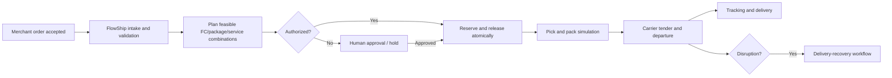

# 3. Simulated company operating model

## Company and network

FlowShip Fulfillment is a third-party logistics provider. Merchants own their inventory and customer promises; FlowShip stores, allocates, picks, packs, tenders, and monitors parcels.

| FC | Code | Role and capabilities | Local operational character |
|---|---|---|---|
| Toronto, ON | `YYZ1` | Full parcel, fragile, apparel, lithium-compliant ground; cross-border export | Largest eastern Canada inventory; 17:00 local ground cutoff |
| Vancouver, BC | `YVR1` | Full parcel, fragile, apparel; limited lithium air | Western Canada/remote-area reach; 16:30 cutoff |
| Columbus, OH | `CMH1` | Full parcel, fragile, apparel, lithium ground; US domestic | Central/eastern US; 18:00 cutoff |

Operating hours, holidays, workload capacity, carrier pickups, and packaging capabilities are effective-dated data, not hard-coded UI facts.

## Merchants and catalogue

- `M-NORTH` Northstar Outdoors: outdoor accessories; protects scarce regional safety stock; permits splits only to save the promise.
- `M-HOME` Hearth & Hue: home goods, including fragile items; premium packaging required for designated SKUs.
- `M-PULSE` PulseTech: electronics/accessories; lithium and high-value restrictions; tighter approval thresholds.

The seed catalogue has 20 SKUs across apparel, outdoor, home, beauty/wellness, electronics accessories, and restricted batteries. Every SKU has dimensions, weight, value, country of origin, harmonized code where relevant, handling flags, and owner merchant.

## Carrier organizations and services

| Network | Example services | Modes / coverage |
|---|---|---|
| Canada Post | Expedited Parcel, Xpresspost | Ground/air; Canadian and remote postal reach |
| UPS | Standard, Worldwide Expedited | Ground/air; CA/US cross-border |
| FedEx | Ground, International Economy, Priority | Ground/air; CA/US |
| Purolator | Ground, Express | Canadian domestic and selected US |
| USPS | Ground Advantage, Priority Mail | US domestic; injected from CMH1 |

Services represent end-to-end offerings—pickup, internal sort/line haul, destination sort, and last mile. The simulation does not schedule assets or hubs. Each service has coverage, cutoffs, parcel limits, restricted-product rules, transit distribution, reliability, remote surcharge, and price components.

## Core operational flow

FC-to-customer fulfillment creates an order shipment. FC-to-FC repositioning is a distinct transfer concept with different lead time, ownership, and audit events; V1 may show a shortage recommendation to reposition but does not automatically execute it.

## Time and geography assumptions

The simulation clock is explicit and controllable. All instants are stored in UTC and rendered in the FC/user timezone. Canadian and US addresses use a curated zone table sufficient for reproducible domestic, cross-border, and remote scenarios; it is not claimed to be a production geocoder.
