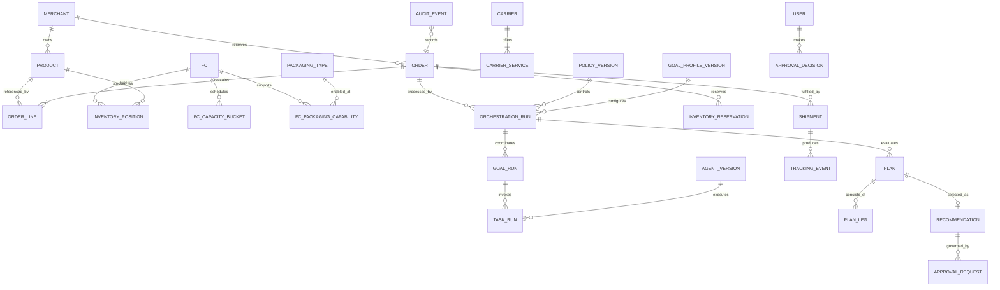

# 5. Entity and relationship model

## Logical model

## Aggregate boundaries

- **Order aggregate:** order, lines, promise, state. A merchant/order-line ownership check occurs on write.
- **Inventory aggregate:** SKU/FC position and reservations. Allocation uses optimistic versioning or row locks; the database constraint is authoritative.
- **Run aggregate:** orchestration run with child goal/task references, checkpoints, and immutable inputs/outputs.
- **Plan aggregate:** immutable plan version and its legs, costs, estimates, constraint/policy results.
- **Shipment aggregate:** package, service, tender, tracking, and events.
- **Policy configuration:** effective-dated immutable versions; editing creates a draft and publishing creates a new version.
- **Audit ledger:** append-only events referencing aggregates; payloads use schema versions and hashes.

## Key entities and required fields

- `Order`: id, merchant, external reference, received time, destination, currency, profile, promise, state, version.
- `OrderLine`: product, quantity, unit value, checkout service contribution.
- `InventoryPosition`: on-hand, reserved, damaged, quarantined, safety stock, version.
- `FC`: timezone, address, hours, capabilities; `FCCapacityBucket`: date/shift, max/current units.
- `CarrierService`: carrier, mode, coverage/restrictions, cutoff rule, transit model, tariff version.
- `Plan`: run, generation method/version, legs, feasibility, rejection reasons, promise probability, cost breakdown, preference vector.
- `Run`: id, parent, type/state, attempt, input/output references, agent/tool/policy versions, timestamps.
- `ApprovalRequest`: recommendation version, threshold/rule, eligible roles, expiry, state.
- `AuditEvent`: fields defined in document 14.

Identifiers are opaque and globally unique. Money is integer minor units plus ISO currency. Quantities are nonnegative integers in V1. Address data stored in runtime operational records is synthetic.
