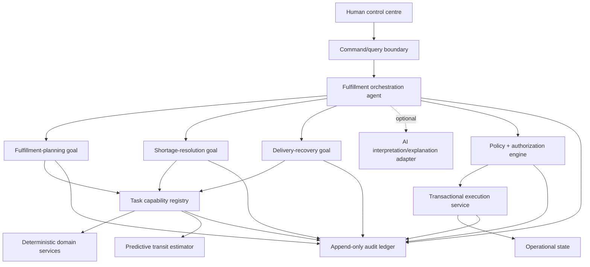

# 9. Agent architecture

## Logical architecture

## Fulfillment orchestration behavior

The orchestrator maintains a durable agenda per order. It interprets typed events, chooses a goal, pins profile/policy versions, evaluates goal outcomes, and selects the next checkpoint. It can switch from planning to shortage resolution, retry planning after a reservation conflict, start recovery after disruption, suspend for approval, and resume from the exact checkpoint.

V1 includes two interchangeable implementations behind the same interface:

1. **Deterministic reference orchestrator**: explicit transition policy; trustworthy baseline and test oracle.
2. **Optional AI-assisted orchestrator (later)**: proposes next goal/action plus structured rationale. A deterministic arbiter validates allowed transitions, required evidence, authority, and tool permissions.

The UI must identify which implementation/version made a proposal.

## Run hierarchy and isolation

One batch has N orchestration runs; each has one active goal run at a time and may have parallel read-only task runs. Mutating tools are serialized through the execution service. Each child output is immutable and referenced by hash/id. Cancellation or failure of one order does not cancel siblings.

## Explanation contract

Each transition records: observed event/facts, considered goals, selected goal, rejected alternatives, governing rule/profile, confidence/data quality, authority decision, and next checkpoint. Explanations are generated from structured facts first; prose is supplemental.

## Human control

Humans do not edit a running agent’s hidden memory. They issue typed commands—approve, reject, hold, retry, pause, resume, reassign goal, or provide corrected data—subject to role and state validation. Every intervention creates a new event and may invalidate downstream recommendations.
