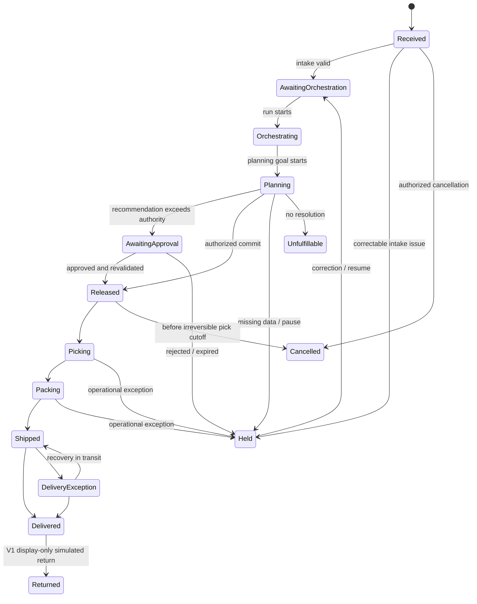

# 13. Order and run state machines

## Order lifecycle

Every transition has current-state/version, actor permission, required evidence, and audit append preconditions. “Orchestrating” and “Planning” are operational states; child run statuses provide finer detail. Cancellation after shipment is prohibited; returns use a distinct flow.

## Generic run lifecycle

`Queued → Running ↔ Waiting` (approval/event/dependency) `→ Succeeded | Failed | Cancelled`. `Running → Pausing → Paused → Queued` supports resume. A retry creates a new attempt linked to the failed attempt; it does not erase or change the prior terminal state.

- Orchestration succeeds when order is released, held with explicit handoff, unfulfillable, cancelled, or a recovery goal reaches a governed terminal checkpoint.
- Goal succeeds only when its success criteria and required-check ledger are satisfied.
- Task succeeds only with schema-valid result/evidence; deterministic false validation is a successful task with a negative result, not a task failure.

## Approval request

`Open → Approved | Rejected | Expired | Withdrawn | Superseded`. Approval requires eligible role, reason where configured, and unchanged recommendation/current facts. Material modification creates a new recommendation and supersedes the old request.

## Shipment

`Created → ReadyForPick → Picking → Packed → Tendered → InTransit → Delivered`. Exceptions: `Tendered/InTransit → Exception → InTransit | Delivered | ReturnToSender`. `Created/ReadyForPick → Cancelled` is allowed before irreversible work. V1 simulates events at controlled clock ticks.

## Entry, retry, timeout, and failure rules

- Entry commands compare aggregate version to prevent stale transitions.
- Exit actions and audit append are atomic.
- Waiting states specify wake event and deadline.
- Expired approvals move the order to Held and require replan if facts are stale.
- Timeouts never infer success; dependency/command status is reconciled by idempotency key.
- Terminal run states are immutable; correction/retry uses linked new records.
